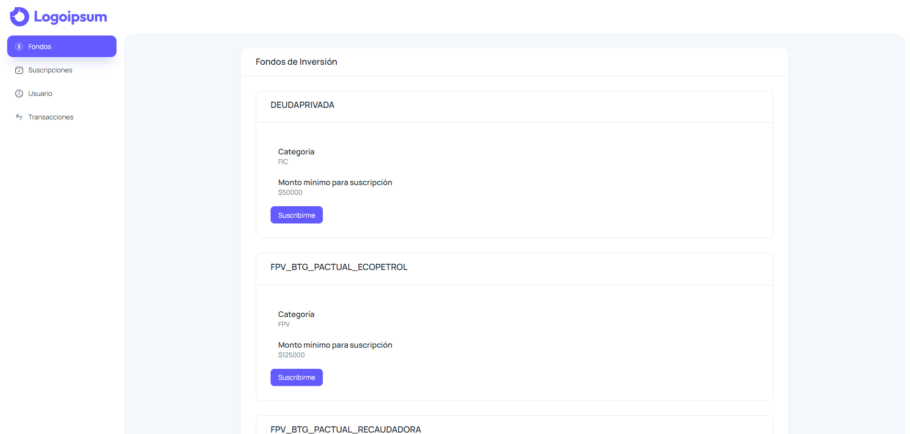
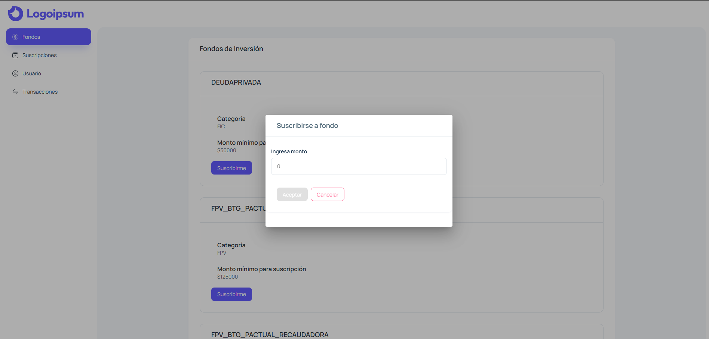
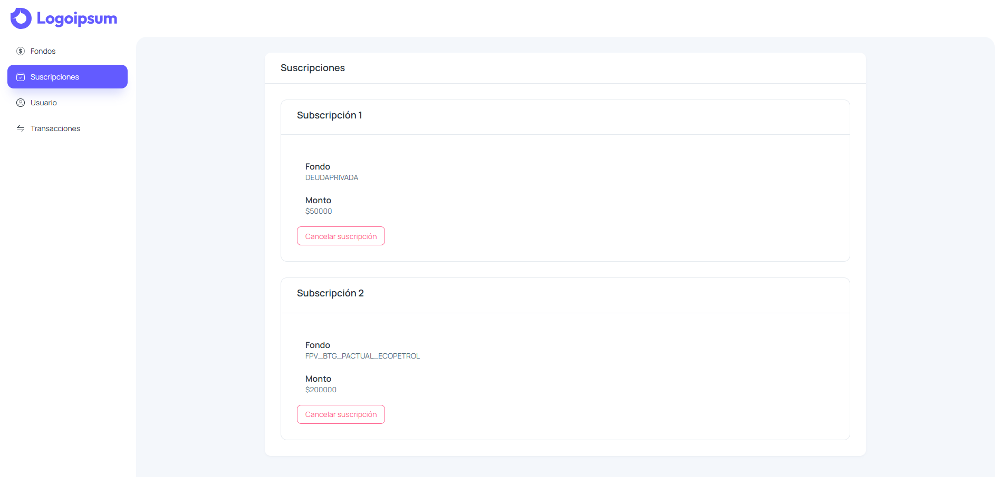
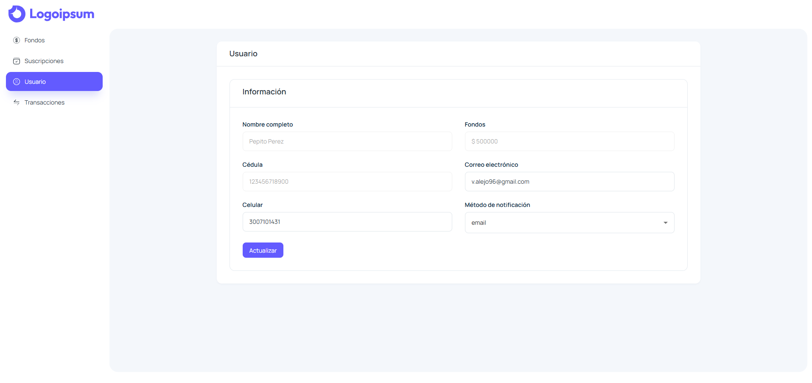
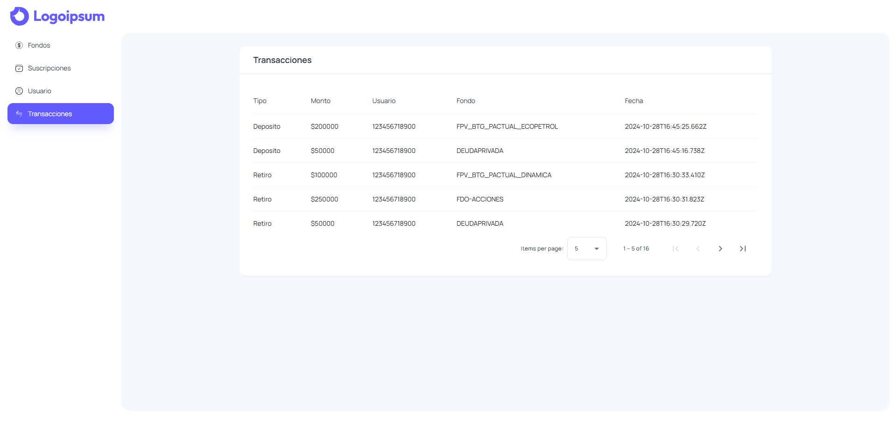

# Prueba técnica SETI: Plataforma de fondos BTG y ejercicio SQL

Este repositorio contiene tanto el frontend desarrollado en Angular y el backend en NestJS de la aplicación. También, contiene los scripts SQL para la resolución del problema. La especificación de la prueba se encuentra en el documento PDF que se encuentra en este repositorio.

La aplicación se encuentra desplegada en AWS, con el frontend hospedado en S3 y el backend junto con la base de datos Mongo ejectándose en un container en una instancia de EC2.

## Acceder a la aplicación desplegada

Para acceder a la aplicación, se ingresa al siguiente link: http://273354646519-app-bucket.s3-website.us-east-2.amazonaws.com

La aplicación tiene tres secciones: Fondos, Suscripciones, Usuario y Transacciones

### Fondos

La aplicación recibe al usuario en la sección principal de Fondos de inversión, donde puede explorar los fondos disponibles a los cuales se puede suscribir y el monto mínimo requerido para abrirlo.



Al hacer click en el botón de Suscribirme, una cuadro de dialogo aparece para definir el monto con el cual se desa suscribir:



Aqui ingresa el monto y, dependiendo del monto que ingrese, se suscribiará al fondo o recibirá un mensaje detallando porque no se pudo suscribir. De ser exitoso, recibirá una notificación por correo o SMS, dependiendo de la configuración de usuario.

### Suscripciones

En esta sección, el usuario puede observar que suscripciones tiene activas y puede cancelarlas si lo desea.



### Usuario

Aquí se observa y actualiza la información del usuario activo. Aquí se configura el método de notificación de las suscripciones.



### Transacciones

Por último, en esta sección se detalla el historial de transacciones de forma paginada, mostrando el tipo de transacción, la cédula del usuario, el nombre del fondo y la fecha de la transacción.



### Documentación de la api

La documentación del API se puede acceder en http://13.58.187.42:3000/docs.

## Despliegue de recursos con CloudFormation

En el archivo `resources.yml` se encuentra especificado la creación de un stack con los recursos, permisos y configuraciones necesarias para el despliegue de la aplicación. La plantilla generará un bucket de S3 y una instancia EC2 con los permisos y configuraciones para la conexión Para esto, se necesita haber creado un par de llaves de acceso en EC2.

En la sección de la creación de la instancia de EC2, se debe reemplazar los valores de ImageId y KeyName por los valores correctos según la región y el nombre del par de llaves, respectivamente.

## Despliegue de artefactos

### Frontend

Dentro del directorio frontend, ejecutar el siguiente comando:

```bash
$ npm run build
```

Se creará el directorio dist que contiene todo los artefactos necesarios del frontend. Todo el contenido del directorio `dist` debe ser cargado dentro del bucket de S3 generado por el CloudFormation.

### Backend

En el directorio base de este repositorio, primero se debe eliminar las carpetas de node_modules y dist (en caso de que existan):

```bash
$ rm -r ./backend/node_modules
$ rm -r ./backend/dist
```

Luego, se conecta a la instancia de EC2 por un tunel SSH, utilizando el archivo `.pem` del par de llaves generado previamente:

```bash
$ ssh -i "llave.pem" ec2-user@<ip publica de la instancia>
```

La terminal quedara conectada a la instancia de EC2. En otra terminal, se transfieren todo el directorio del backend:

```bash
$ scp -i "llave.pem" -r ./backend/  ec2-user@<ip publica de la instancia>:~/
```

Volviendo a la terminal conectada a la instancia, se ingresa al directorio del backend y se crean los contenedores de la base de datos y el backend mediante docker compose:

```bash
$ cd backend
$ docker-compose up -d
```
